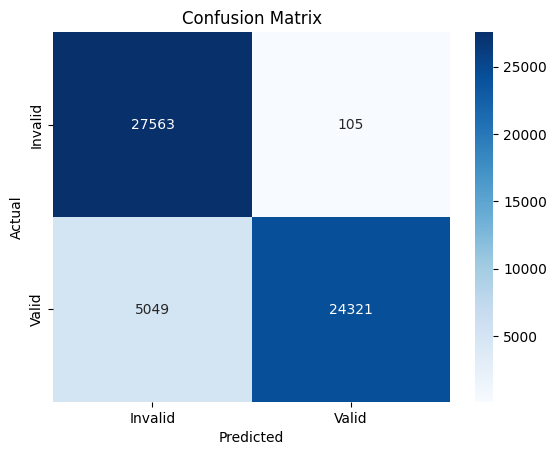

# Subject Spam Detector (ML Model)

A simple **machine learning model** that classifies whether a given subject/title (e.g., book titles, course names, etc.) is **valid** or **spam-like**.  
Built with `scikit-learn`, trained on a custom dataset of 300K+ samples, and exported as an **Joblib and OONX** model for portable deployment.

---

## Overview

This project prepares, cleans, and merges multiple CSV datasets of subjects/titles, then generates additional "invalid" (spam-like) examples.  
It trains a **Logistic Regression** model using **TF-IDF vectorization (1–2 n-grams)** to detect invalid or nonsensical subjects.

| Metric       |  Score |
| ------------ | -----: |
| **Accuracy** | 0.9096 |
| **ROC AUC**  | 0.9137 |

---

## Dataset Preparation

1. All datasets are read from the `datasets/` directory downloaded from kaggle.
   - `data1.csv` → `data5.csv`
2. Column names are normalized (`subject`, `label`).
3. Missing subjects are removed.
4. Duplicate rows are dropped.
5. 70k fake (invalid) subjects are generated using random strings and spammy patterns.
6. Final dataset is present inside /datasets.

| Label | Meaning               |   Count |
| ----- | --------------------- | ------: |
| `1`   | Valid subject/title   | 146,849 |
| `0`   | Invalid (spam/random) | 176,000 |

Final dataset size: **322,849 samples**

---

## Text Preprocessing

The function `transform_text()` performs:

- Lowercasing
- Tokenization using `nltk.word_tokenize`
- Removal of stopwords and punctuation
- Word stemming via `PorterStemmer`

Example:

```python
transform_text("A Practical Example of Machine Learning")
# Output: "practic exampl machin learn"
```

## Model Architecture

Pipeline used:

```python
pipeline = Pipeline([
    ('tfidf', TfidfVectorizer(max_features=800, ngram_range=(1, 2))),
    ('classifier', LogisticRegression())
])

-TF-IDF Vectorizer: 1–2 n-grams, max 800 features
- Classifier: Logistic Regression
- Exported as: subject_spam_detector.onnx
```

## Evaluation Results

### Confusion matrix



### Classification Report

| Class                | Precision | Recall | F1 Score   | Support    |
| -------------------- | --------- | ------ | ---------- | ---------- |
| 0 (Invalid)          | 0.8452    | 0.9962 | 0.9145     | 27,668     |
| 1 (Valid)            | 0.9957    | 0.8281 | 0.9042     | 29,370     |
| **Overall Accuracy** | –         | –      | **0.9096** | **57,038** |

## Example Predictions

```python
improved_pipeline.fit(X_train, y_train)

# Test on your problematic examples
test_subjects = [
    "Introduction to Machine Learning",
    "skfjskfjs kjfkjsf",
    "Data Structures and Algorithms",
    "qwerty 123 test",
    "Digital Logic Design",
    "xyzabc defghi",  # More gibberish
    "Computer Science Fundamentals",
    "kkjjhhggff"  # More gibberish
]

print("\nImproved model predictions:")
predictions = improved_pipeline.predict(test_subjects)
probabilities = improved_pipeline.predict_proba(test_subjects)[:, 1]

for subj, pred, prob in zip(test_subjects, predictions, probabilities):
    print(f"Subject: {subj}")
    print(f"Predicted: {'Valid ✅' if pred==1 else 'Spam ❌'}")
    print(f"Valid probability: {prob:.4f}")
    print("-" * 50)
```

and the result is

```bash
Subject: Introduction to Machine Learning
Predicted: Valid ✅
Valid probability: 0.9977
--------------------------------------------------
Subject: skfjskfjs kjfkjsf
Predicted: Spam ❌
Valid probability: 0.0037
--------------------------------------------------
Subject: Data Structures and Algorithms
Predicted: Valid ✅
Valid probability: 0.9921
--------------------------------------------------
Subject: qwerty 123 test
Predicted: Valid ✅
Valid probability: 0.8610
--------------------------------------------------
Subject: Digital Logic Design
Predicted: Valid ✅
Valid probability: 0.9730
--------------------------------------------------
Subject: xyzabc defghi
Predicted: Spam ❌
Valid probability: 0.0235
--------------------------------------------------
Subject: Computer Science Fundamentals
Predicted: Valid ✅
Valid probability: 0.9957
--------------------------------------------------
Subject: kkjjhhggff
Predicted: Spam ❌
Valid probability: 0.0009
--------------------------------------------------
```
